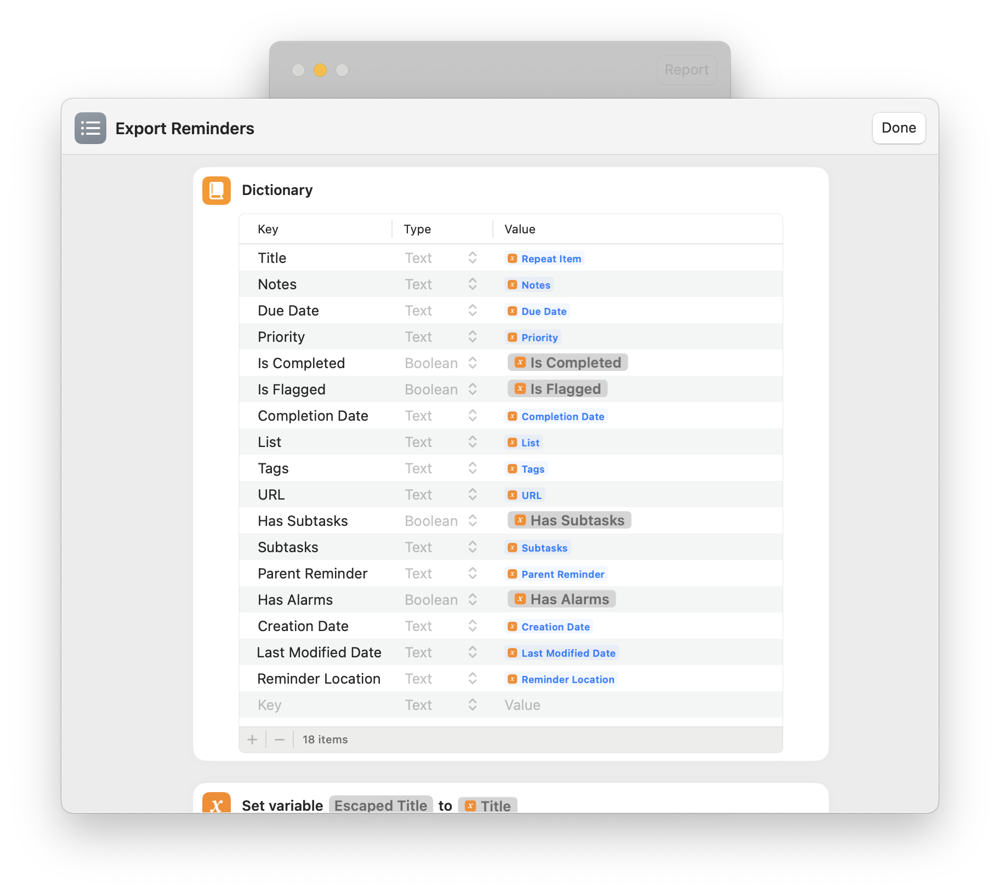

# Apple Reminders Exporter

Export Apple Reminders to JSON on macOS, using `Shortcuts.app` and a bit~~e~~ of Python

> See also [Apple Notes Exporter](https://github.com/Kylmakalle/apple-notes-exporter)

1. Clone repository (Terminal)

```shell
git clone https://github.com/Kylmakalle/apple-reminders-exporter
cd apple-reminders-exporter
```

1. Install `Export Reminders` Shortcut using [Link](https://www.icloud.com/shortcuts/d1d24fece46d433bb8f5ab6e591764f1) or `open "Export Reminders.shortcut"` file
2. `Shortucts.app` > Settings > Advanced > Allow Sharing Large Amounts of Data
3. Run `make`
   1. `Shortcuts.app` will ask for your approval to save Reminders as Dictionaries (JSON). Click **Allow**.
   2. If you miss-clicked or something does not work, Go to `Export Reminders` Shortcut > **(i)** Shotcut details > Privacy > Reset Privacy and Try again.
4. Done! You can find JSON files at [reminders](./reminders) directory

## macOS Shortcut source

Probably, you're here because you don't want to lose your data due to various reasons. Me too. I don't trust `.shortcuts` format much, that's why you can find visual source of `Export Notes.shortcut` in [shortcut-source](./shortcut-source).



## Tips & Tricks

1. Export is not supported for Smart Lists. However, with JSON it should be pretty easy to replicate filters and behaviour for system of your choice.
   1. For some reason, we can't export value of "When Messaging Person". Shortcut execution simply hangs.
2. It takes about 10 minutes to export 1000 reminders (for me).
3. Filters for `Find Reminders` action does not work. If you want to export only specific folders, add second `Find Reminders` action that will consume `Reminders` variable from first Find. Here you will be able to successfully filter the Reminders.
4. Reminders are actually `.ics` files. However, it looks like some other metadata lies in internal/undocumented databases.

## Alternative Approaches

While I think exporting via `Shortcuts.app` is more-or-less official and _should_ less likely to break in the future, here's what I've found:

- [Reminders CLI](https://github.com/keith/reminders-cli)
- https://gist.github.com/0xdevalias/ccc2b083ff58b52aa701462f2cfb3cc8
